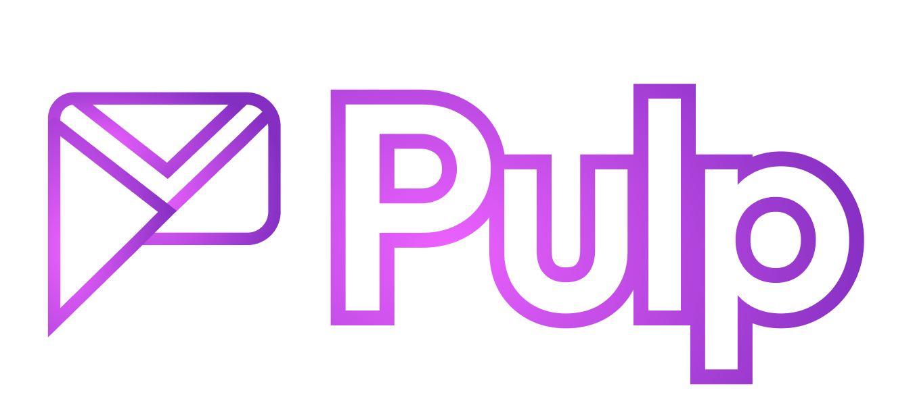

  
  <h1>PulpAI — Your Identity. One Stream.</h1>
  
<strong>PulpAI is your personal action layer.</strong>

PulpAI aggregates your fragmented digital communications into a single, executable stream. Instead of context-switching between dozens of apps like Email, Slack, WhatsApp, Instagram, or CRM tools, PulpAI extracts tasks and intent from your messages. 

It acts as the operating system for your digital identity—presenting everything in one unified chat where you can decide, approve, and act instantly. Whether for professional project management or personal life, PulpAI merges your worlds into one interface.

  <a href="#roadmap">Roadmap</a> · <a href="#edge">The Pulp Edge</a> · <a href="https://docs.pulpai.com">Docs</a> · <a href="#getting-started">Getting Started</a>

---

## 🗺️ The Roadmap

### Phase 1: The WhatsApp Inbox
Your emails and messages arrive as summarized WhatsApp notifications with clear buttons (CTAs) to act immediately.
* **Style Mirroring:** Analyzes sender tone to draft perfectly optimized, context-aware replies.
* **Confidence through Control:** Keeps you in the loop with one-tap manual approvals before any action is taken.
* **Executable CTAs:** Turns wordy emails into simple buttons, enabling instant replies while you're on the move.

### Phase 2: The Pulp App
A single, smart interface that adapts to your tasks and replaces communication via scattered apps.
* **Generative UI:** The interface changes based on content; get a meeting request, and a calendar widget appears. Get an invoice, and a payment button pops up.
* **Platform Mirroring:** Consolidates all your services (Gmail, Slack, Teams) into one clean, unified feed.
* **Fluid Experience:** Built with Vercel AI SDK and React Server Components for a fast, native-feeling experience.

### Phase 3: Identity Aggregation 🏆
The end of channel-based messaging. All messages from one person—no matter if email, Slack, or LinkedIn—are bundled into one thread.
* **One Thread, Every Channel:** Stop hunting through apps. All interactions with a specific contact live in a single, chronological timeline.
* **Identity Mapping Engine:** Automatically links disparate handles (Email, Slack ID, Socials) to a single verified human entity.
* **Unified Intelligence:** Provides a holistic view of your relationships, decoupling your communication from the platform silos.

---

## ⚡ The Pulp Edge

* **Eradicate Response Inertia:** We bridge the gap between receiving information and taking action. Instead of manual toggling, Pulp turns passive messages into structured, executable tasks.
* **Your Executive Command Center:** Stop managing siloed apps; start managing outcomes. Pulp centralizes your scattered digital threads, letting you summarize, draft, and approve in one fluid interface.
* **Unified Identity Architecture:** We move from channel-centric to person-centric communication. By mapping fragmented handles (Email, Slack, Socials) to a single identity, we create a unified view of your relationships that platform silos can’t match.
* **Velocity with Vigilance (HITL):** Get the raw speed of an autonomous agent without the "black box" risk. With our Human-in-the-Loop architecture, you stay the final authority while the AI handles the heavy lifting.

---

## 🛠 Tech Stack Evolution

| Feature | Phase 1: Speed-to-Market (Current) | Phase 2: Performance (Native) | Phase 3: Intelligence (Scale) |
| :--- | :--- | :--- | :--- |
| **Focus** | Validation & Prototyping | Scalability & Custom UX | Identity Mapping & RAG |
| **Orchestration** | n8n (Self-hosted) | Node.js (TypeScript) | Custom Event-Driven Microservices |
| **Frontend** | WhatsApp Business API | Next.js & React Native | Unified Cross-Platform App |
| **AI Engine** | GPT-4o / Claude 3.5 | Vercel AI SDK (GenUI) | Custom RAG via Pinecone |
| **Database** | n8n Internal (JSON) | Supabase (PostgreSQL) | Vector DB + Redis/BullMQ |
| **Infrastructure** | Low-code / Docker | Cloud-native (Vercel/Supa) | AWS (EKS / Kubernetes) |
| **Core Value** | "Last Mile" Delivery | Seamless UX & Low Latency | Unified Identity Architecture |

---

## ⚙️ How it Works (Phase 1: The n8n Workflow)

The current MVP utilizes **n8n** as a powerful orchestration engine to bridge the gap between legacy email protocols and modern messaging interfaces.

### 1. Inbound Intelligence
* **Trigger:** The workflow monitors the **Gmail API** for incoming messages in real-time.
* **Pre-Processing:** A custom logic node filters for priority and extracts the core context, removing clutter like signatures and legal disclaimers.

| INBOUND (Email → WhatsApp) | OUTBOUND (WhatsApp → Email) |
| :--- | :--- |
| <pre>Gmail API Trigger        │        ▼ ┌──────────────┐ │ Gemini Agent │───> Extract Action Items └──────┬───────┘        │        ▼ ┌──────────────┐ │  n8n Parser  │───> Map Data & Store Mapping └──────┬───────┘        │        ▼ WhatsApp Business API (Alert + CTA)</pre> | <pre>WhatsApp Webhook        │        ▼ ┌──────────────┐ │ Lookup State │───> Fetch Original Thread └──────┬───────┘        │        ▼ ┌──────────────┐ │ Gemini Agent │───> Style Mirroring & Reply Gen └──────┬───────┘        │        ▼ Gmail Send Action (Thread Reply)</pre> |

### 2. Contextual Style Mirroring
* **Analysis:** The extracted content is sent to an **LLM (GPT-4o/Claude)** with a specific system prompt.
* **Tone Matching:** The AI analyzes the sender's professional tone and linguistic patterns.
* **Drafting:** It generates a high-quality response draft that mirrors the sender's style while addressing all action items.

### 3. Human-in-the-Loop Approval
* **Notification:** The draft is pushed to the user via the **WhatsApp Business API** as an interactive message.
* **Validation:** The user can review, edit, or approve the draft with a single tap.
* **Execution:** Upon approval, an **HTTP Request Node** triggers the final Gmail send-action, maintaining the original thread integrity.

---

## 🛡️ Core Principles

* **Privacy by Design:** Data is only processed during the active workflow execution. No emails are stored permanently in the orchestration layer.
* **Confidence through Control:** We eliminate "AI hallucinations" from reaching the client by keeping the human user as the final gatekeeper.
* **Zero-Inertia:** Decisions are made where you already spend your time: in your mobile messaging app.

---

## 🤝 Investment & Vision

PulpAI is building the **Invisible OS** for professional communication. We are currently scaling from our successful **n8n Proof-of-Concept** to a robust, native architecture.

**Are you ready to eliminate the efficiency leaks and build the future of the Unified Feed?**

---
[Contact / GitHub Link / Documentation]
